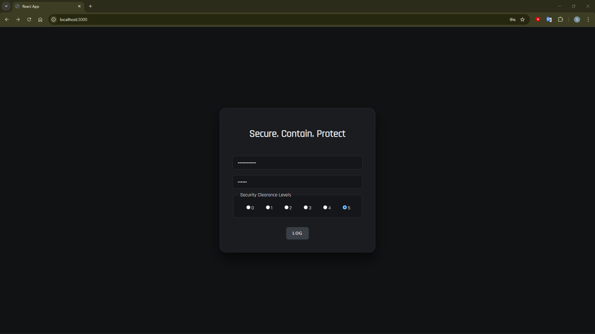
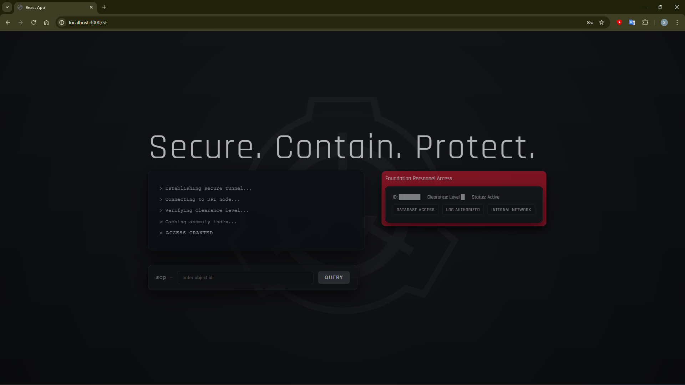
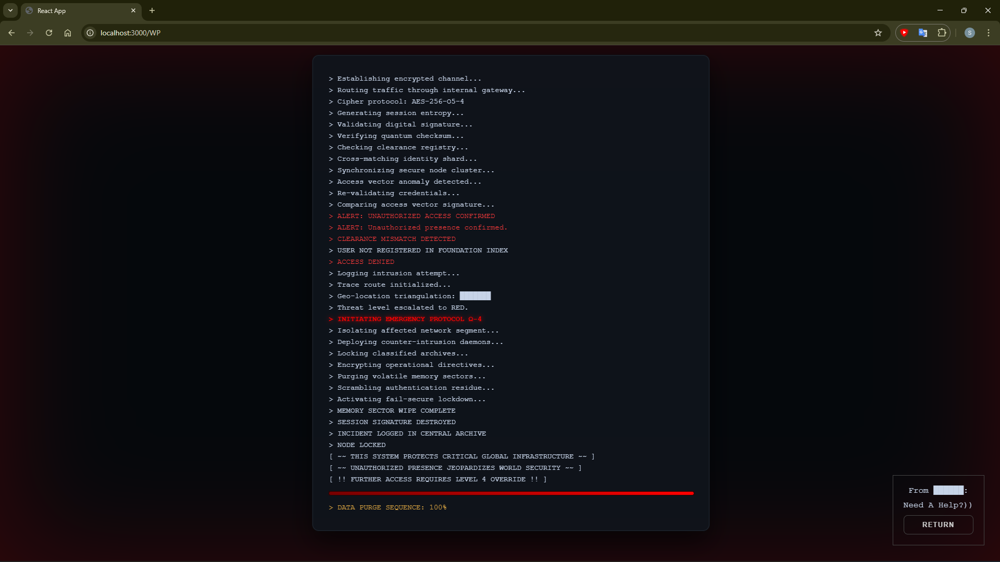

# SCP Search Anomaly
*(Internal Foundation Query System)*

### What is SCP?
> the SCP Foundation is a secret organization that is responsible for capturing, containing, and studying various paranormal, supernatural, and other mysterious phenomena (known as "anomalies" or "SCPs"), while also keeping their existence hidden from the rest of society.

### What Is Website For?
SCP Search Anomaly is a simulated internal Foundation system built with React.
The interface reproduces a restricted-access environment where personnel must authenticate before accessing the anomaly search engine.

### Site Structure:
* Main Menu:
    * User display for log in, display gets:
        1. ID-Agent
        2. Password
        3. Security Clearance Levels
* Search engine:
    * Terminal
    * User Card
    * Search fields
* WormProtocol: 
    * catch unauthorized users

### Image:
* Home: 

* Search:

*FPA (Foundation Personnel Access) colour varies based on the security clearance level selected by the user (see `src/style/SE.css` for exact values).*
  - *Level 0: **grey‑beige** (`#a99e9bae`)*
  - *Level 1: **bright yellow** (`#f7df01ae`)*
  - *Level 2: **yellow‑orange** (`#f6c6086c`)*
  - *Level 3: **orange** (`#f39f39ae`)*
  - *Level 4: **red‑orange** (`#ed5625ae`)*
  - *Level 5: **deep red** (`#e81c36ae`)*

* Worm:
